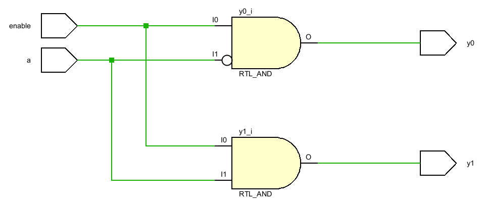
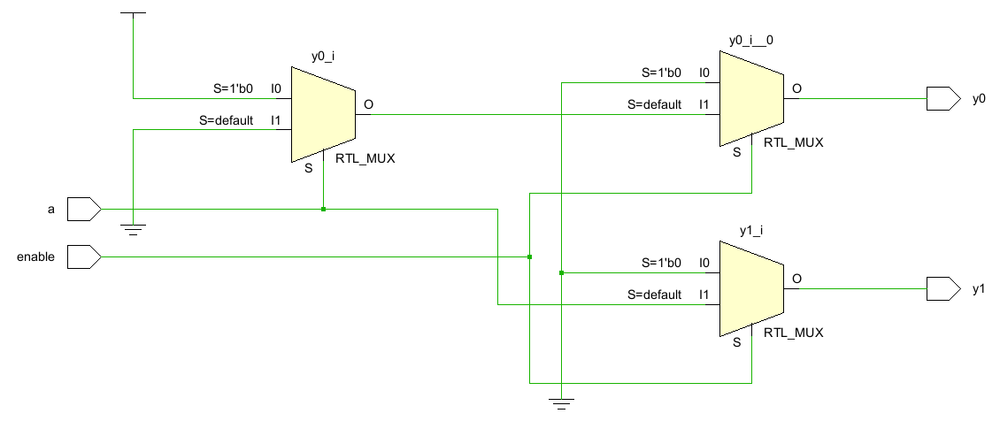

### 1-to-2 Decoder Truth Table
|enable|a|y0|y1|
|------|-|--|--|
|0     |x|0 |0 |
|1     |0|1 |0 |
|1     |1|0 |1 |

#### Using Assign Statements:
  

#### Using an Always Block with Conditional Logic

